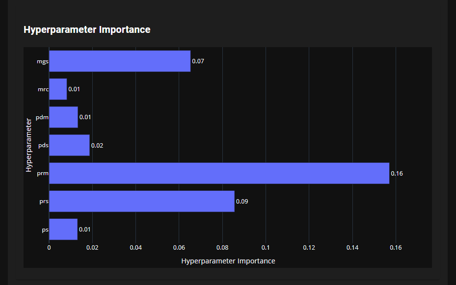
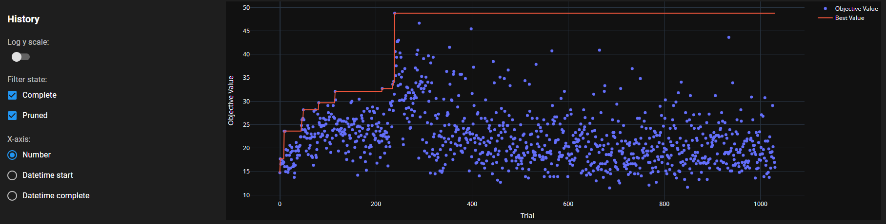
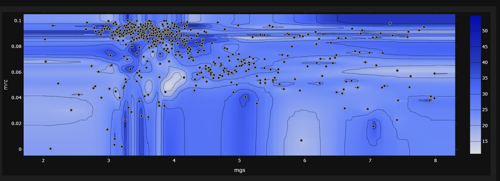
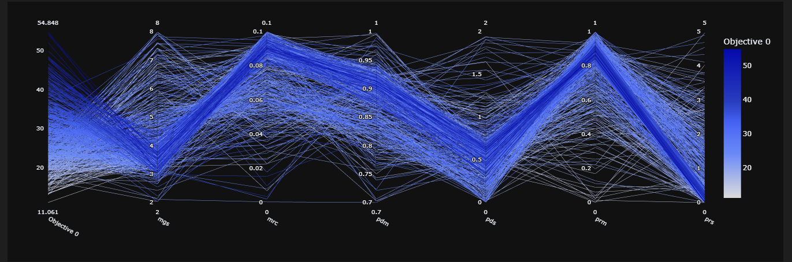
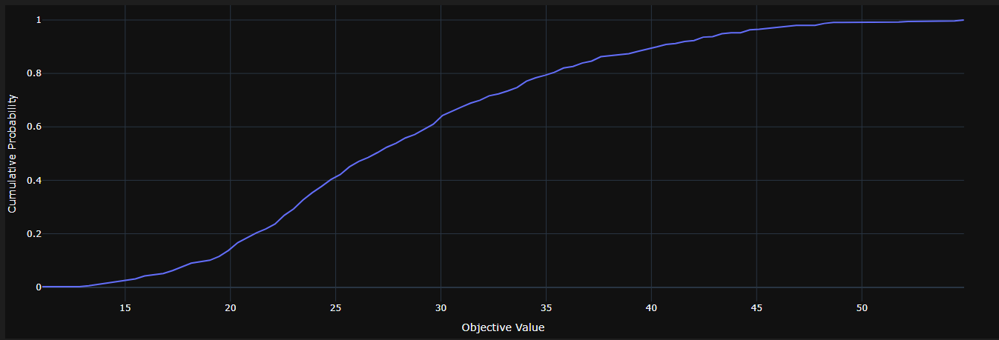

# Agent based Ant simulation optimizer

For a given simulation (in kotlin) we use `optuna` to optimize the hyperparameters that are availible.

## Dependencies:

- Running simulation. (in kotlin)
- optuna
- matplotlib
- numpy

## Testing

Execute the `test.py` to check if interacting with the simulation works.
Starting the `main.py` creates an optuna database that is used to save the optimization results and show visualizations.

## Results

You can check out the results for yourself by uploading the `db.sqlite3` file to the [optuna dashboard](https://optuna.github.io/optuna-dashboard/).

Hyperparameter Relevanz:

Trials:

Graphs:

